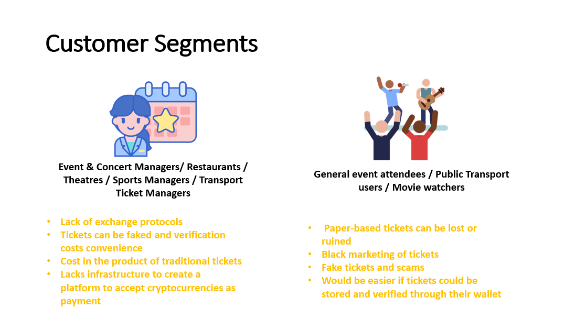

# RipTix - Decentralized Ticketing with NFTs
.png>)

## XRP EVM Sidechain
This DAPP is made for the XRP EVM Sidechain and is deployed on it. One can deploy their own Ticket Booking Portal by cloning the GitHub repo, filling in required fields in .env, and using 
```npx hardhat run src/backend/scripts/deploy.js --network xrplEvmSidechain```

more about it : https://opensource.ripple.com/docs/evm-sidechain/intro-to-evm-sidechain 

## Overview
RipTix is a decentralized ticketing platform that leverages the power of Non-Fungible Tokens (NFTs) on the XRP EVM compatible chain. This project aims to revolutionize the event ticketing industry by introducing transparency, security, and uniqueness through blockchain technology.


## Technology Stack & Tools
- Solidity (Smart Contract Development)
- JavaScript (React & Testing)
- Hardhat (Development Framework)
- Ethers (Blockchain Interaction)
- IPFS (Metadata Storage)
- React Routers (Navigational Components)

## Requirements For Initial Setup
1. Install NodeJS (compatible with any version below 16.5.0)
2. Install Hardhat

## Setting Up
1. **Clone/Download the Repository**
   ```bash
   $ git clone https://github.com/your-username/RipTix.git
   ```

2. **Install Dependencies**
   ```bash
   $ cd RipTix
   $ npm install
   ```

3. **Boot up Local Development Blockchain**
   ```bash
   $ cd RipTix
   $ npx hardhat node
   ```

4. **Testing using Hardhat on Metamask**
   - Copy the private key of the addresses and import them into Metamask.
   - Connect Metamask to the Hardhat blockchain using the network `127.0.0.1:8545`.
   - If Hardhat is not added to the list of networks on Metamask, add it by entering "Hardhat" for the network name, "http://127.0.0.1:8545" for the new RPC URL, and "31337" for the chain ID.

5. **Migrate Smart Contracts to XRP EVM Sidechain**
   ```bash
   $ npx hardhat run src/backend/scripts/deploy.js --network xrplEvmSidechain
   ```

6. **Setting Metamask for the Sidechain**
Network Name : XRPL EVM Sidechain
New RPC URL : https://rpc-evm-sidechain.xrpl.org
Chain ID : 1440002
Currency Symbol : XRP
Block Explorer : https://evm-sidechain.xrpl.org

**Running Smart Contract Tests**
   ```bash
   $ npx hardhat test
   ```

7. **Launch Frontend**
   ```bash
   $ npm run start
   ```